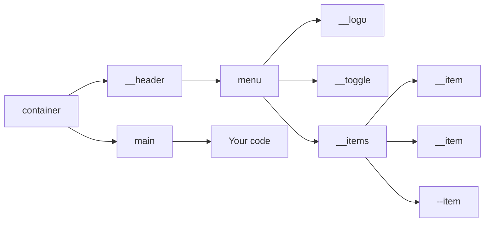
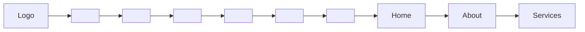
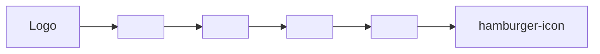
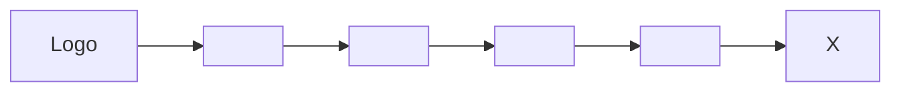
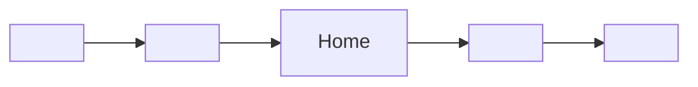
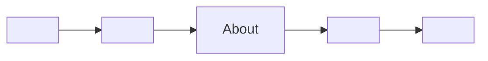
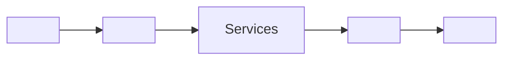

# Free website template

Hi! I'm Rudi.
I made a free **template** for you to use to create a website that uses a responsive navigation bar with a mobile first approach.

## 1. The **template** has the following HTML format:

The graph below shows the structure of the HTML document. The **template** has a header consisting of a navigation bar and a main section. You should add your website body to the main section.

## 2. Details about the template:

The **template** makes use of a BEM (Block \_\_Element --Modifier) naming convention for improved readability. It can be downloaded by just pulling from the repo. I used SCSS to style the **template** using partials for improved maintainability. I also used JQuery for the functionality of the hamburger menu toggle.

### 2.1 Template layout:

The **template** makes use of a generalized modern web page where the menu**logo is aligned to the top left and the menu**items (links) are aligned to the top right of the navigation bar.

### 2.2 Template functionality:

The **template** is fully responsive, meaning that it adjusts the styling of the HTML as well as the functionality of the website based on the what devise is viewing the website.

#### 2.2.1 Mobile View

In mobile view (a view port smaller than 600px) the menu**logo and menu**toggle (hamburger-menu-icon) will be be displayed in the navigation bar with the menu\_\_items being hidden.

Upon clicking the menu**toggle the menu**items will be displayed vertically and the menu\_\_toggle icon will change to a close-menu-icon.

Clicking the menu**toggle again will revert the display back to the original and will change the menu**toggle icon back to the hamburger-menu-icon.

#### 2.2.2 Desktop View

In desktop view (a view port larger than 600px) the menu**logo and menu**items will be be displayed in the navigation bar with the menu\_\_toggle being hidden.

## 3. How to use the **template**:

Pull from the repo and insert your own code in the main section

## 4. Screen Shots of **template**:

Desktop View:

Mobile View:

Mobile View (toggled):

